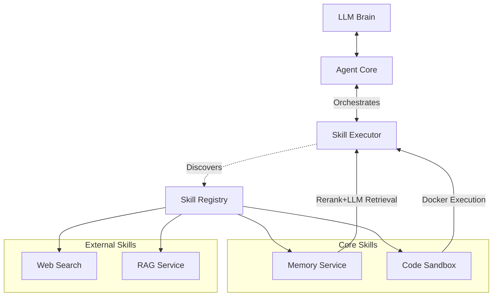

[中文版](./docs/README_zh.md) | **English**

# MyAgent: General Purpose Skill-Based Agent Framework

MyAgent is a **General Purpose Intelligent Agent** built upon a dynamic **Skill Architecture**. Unlike traditional agents with hard-coded tools, MyAgent is designed to be infinitely extensible through a decentralized "Skill" system. Does the agent need to search the web? Just drop in a `websearch` skill. Need to execute code? Drop in a `sandbox` skill.

The core innovation lies in the **SKILL.md** protocol. Every capability is self-contained in a service directory requiring only a `SKILL.md` (definition) and a client implementation. The core `SkillExecutor` automatically discovers, loads, and orchestrates these skills, providing them to the heavy-weight Brain (LLM) as executable tools.

---

## 🚀 Core Concept: The Skill Agent

In MyAgent, a **Skill** is the fundamental atomic unit of agency.

### 1. The Protocol (SKILL.md)
Each skill is defined by a markdown file that serves dual purposes:
- **System Metadata**: YAML Frontmatter defines how to load the code (`client_class`) and how to execute it (`default_method`).
- **Agent Knowledge**: The Markdown content describes *what* the skill does and *how* to use it, which is directly consumed by the LLM to understand its own capabilities.

### 2. Architecture



- **Decoupled**: Skills are decoupled from the core agent logic.
- **Hot-Pluggable**: New skills are recognized by the `SkillRegistry` dynamically.
- **Self-Describing**: The documentation *is* the interface.

### 3. Core Capabilities
The agent's power comes from its built-in skills:
- **🧠 Session Memory**: Two-stage retrieval (Rerank → LLM Knowledge Extraction) within the current session. Stage 1 filters top candidates, Stage 2 uses LLM to extract and summarize relevant knowledge - not just selecting messages, but organizing useful information for the Agent.
- **🛡️ Code Sandbox**: Safely executes Python/Shell code in isolated Docker containers with resource limits and auto-cleanup.
- **🌐 Web Search**: Connects to the internet to fetch real-time information.

## 🛠️ Features

- **Dynamic Discovery**: Uses `app/agent/core/skill_executor.py` to recursively scan `services/` for capabilities.
- **Standardized Interface**: All skills implement a unified `Client` interface but expose specific logic via `SKILL.md`.
- **Environment Aware**: Skills can span from local file manipulation to remote API calls (Web Search, RAG, etc.).

## 📂 Project Structure

```bash
myagent/
├── app/
│   ├── agent/
│   │   ├── core/
│   │   │   └── skill_executor.py  # 🧠 The Brain's Hand: Loads and runs skillsba
│   │   └── ...
├── services/                      # 🧱 Skill Storage
│   ├── websearch_service/
│   │   ├── SKILL.md               # 📝 Definition: "I can search the web..."
│   │   └── client.py              # ⚙️ Implementation: Actual search logic
│   ├── sandbox_service/
│   │   ├── SKILL.md
│   │   └── ...
│   └── ...
├── docker-compose.yml
└── ...
```

## 👣 Getting Started

### Prerequisites
- Docker & Docker Compose
- Python 3.11+

### Installation

1.  **Clone the repository**
    ```bash
    git clone https://github.com/Lin-A1/myagent.git
    cd myagent
    ```

2.  **Environment Setup**
    ```bash
    cp .env.example .env
    # Configure your API keys (OpenAI, etc.)
    ```https://github.com/Lin-A1/myagent.git

3.  **Run with Docker**
    ```bash
    docker-compose up --build
    ```

## 💻 Frontend Interface
https://github.com/Lin-A1/myagent.git


### Running the Frontend
The frontend needs to be started in the development environment:

1.  **Start Backend**: Ensure Docker services are running.
2.  **Start Frontend**:
    ```bash
    cd web/frontend
    npm install
    npm run dev
    ```
3.  Access at `http://localhost:5173`

## 🔧 How to Add a New Skill

### Executable Skill (with client)
1.  **Create Directory**: `mkdir services/my_new_skill`
2.  **Define Skill**: Create `SKILL.md`.
    ```markdown
    ---
    name: my_new_skill
    description: A description of what this skill does.
    client_class: MyNewSkillClient
    default_method: run
    ---

    ## Usage
    Description for the LLM...
    ```
3.  **Implement Client**: Create `client.py` with `class MyNewSkillClient`.
4.  **Restart**: The Agent will automatically detect `my_new_skill`.

### Documentation-Only Skill (no client needed)
For reference documents, guidelines, or templates that don't need code execution:

```markdown
---
name: coding_guidelines
description: Code style and best practices reference.
executable: false
related_tools:        # Optional: attach this guide to other tools
  - sandbox_service
---

## Guidelines
Your documentation content here...
```

- Set `executable: false` to mark as documentation-only
- Use `related_tools` to attach guidelines to executable tools (the guide will appear under those tools)


## 📅 Recent Updates

### 2026-01-08
- ✅ **Session Persistence**: Session survives page refresh, automatically restores chat history (via localStorage).
- ✅ **Dialogue Turn Calculation**: 4-turn threshold now counts only user messages (1 turn = 1 user message + corresponding assistant/tool), tool calls no longer affect threshold.
- ✅ **LLM Knowledge Extraction**: Memory retrieval Stage 2 upgraded from "selecting indices" to "LLM directly organizing knowledge", returning usable information instead of raw messages.
- ✅ **WebSearch Fixes**: Fixed OCR and SearXNG container network connection issues.

### 2026-01-07
- ✅ **Secure Code Sandbox**: Docker-based safe execution environment for Python/Shell, with resource limits and auto-cleanup.
- ✅ **Autonomous Memory**: `memory_service` with Rerank+LLM two-stage retrieval, allowing the Agent to autonomously recall past conversations.
- ✅ **Robust Agent Core**: Improved connection handling, automatic session title generation, and defensive programming against API failures.
- ✅ **UI Enhancements**: Fixed message editing/regeneration flow, better error handling, and visualized "Thinking" state.
- ✅ **Search Strategy**: Optimized "Knowledge First" rule - Agent prioritizes internal knowledge before searching.

### Roadmap
- [ ] **File Operation Service** (`file_service`): Capability to create, read, update, and delete files.
- [ ] **Agent Workspace**: Dedicated file operation space allowing the Agent to manipulate files like an AI IDE.
- [ ] **Todo Management**: A skill to manage tasks and to-do lists.

---

