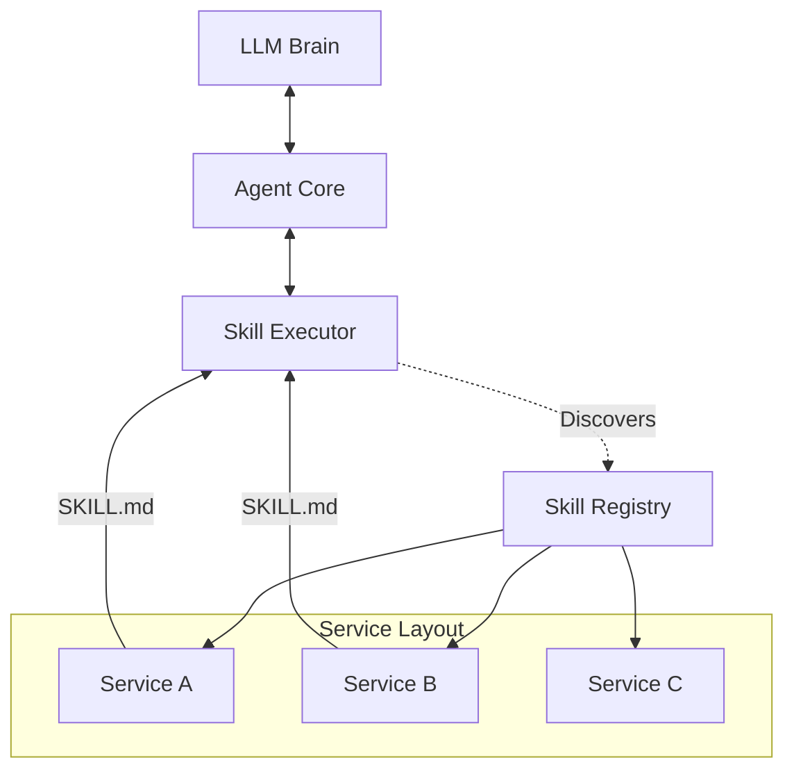

[中文版](./docs/README_zh.md) | **English**

# MyAgent: General Purpose Skill-Based Agent Framework

MyAgent is a **General Purpose Intelligent Agent** built upon a dynamic **Skill Architecture**. Unlike traditional agents with hard-coded tools, MyAgent is designed to be infinitely extensible through a decentralized "Skill" system. Does the agent need to search the web? Just drop in a `websearch` skill. Need to execute code? Drop in a `sandbox` skill.

The core innovation lies in the **SKILL.md** protocol. Every capability is self-contained in a service directory requiring only a `SKILL.md` (definition) and a client implementation. The core `SkillExecutor` automatically discovers, loads, and orchestrates these skills, providing them to the heavy-weight Brain (LLM) as executable tools.

---

## 🚀 Core Concept: The Skill Agent

In MyAgent, a **Skill** is the fundamental atomic unit of agency.

### 1. The Protocol (SKILL.md)
Each skill is defined by a markdown file that serves dual purposes:
- **System Metadata**: YAML Frontmatter defines how to load the code (`client_class`) and how to execute it (`default_method`).
- **Agent Knowledge**: The Markdown content describes *what* the skill does and *how* to use it, which is directly consumed by the LLM to understand its own capabilities.

### 2. Architecture



- **Decoupled**: Skills are decoupled from the core agent logic.
- **Hot-Pluggable**: New skills are recognized by the `SkillRegistry` dynamically.
- **Self-Describing**: The documentation *is* the interface.

## 🛠️ Features

- **Dynamic Discovery**: Uses `app/agent/core/skill_executor.py` to recursively scan `services/` for capabilities.
- **Multi-Modal**: Support for text, code execution, and VLM (Visual Language Model) skills.
- **Standardized Interface**: All skills implement a unified `Client` interface but expose specific logic via `SKILL.md`.
- **Environment Aware**: Skills can span from local file manipulation to remote API calls (Web Search, RAG, etc.).

## 📂 Project Structure

```bash
myagent/
├── app/
│   ├── agent/
│   │   ├── core/
│   │   │   └── skill_executor.py  # 🧠 The Brain's Hand: Loads and runs skillsba
│   │   └── ...
├── services/                      # 🧱 Skill Storage
│   ├── websearch_service/
│   │   ├── SKILL.md               # 📝 Definition: "I can search the web..."
│   │   └── client.py              # ⚙️ Implementation: Actual search logic
│   ├── sandbox_service/
│   │   ├── SKILL.md
│   │   └── ...
│   └── ...
├── docker-compose.yml
└── ...
```

## 👣 Getting Started

### Prerequisites
- Docker & Docker Compose
- Python 3.11+

### Installation

1.  **Clone the repository**
    ```bash
    git clone https://github.com/Lin-A1/myagent.git
    cd myagent
    ```

2.  **Environment Setup**
    ```bash
    cp .env.example .env
    # Configure your API keys (OpenAI, etc.)
    ```https://github.com/Lin-A1/myagent.git

3.  **Run with Docker**
    ```bash
    docker-compose up --build
    ```

## 💻 Frontend Interface
https://github.com/Lin-A1/myagent.git


### Running the Frontend
The frontend needs to be started in the development environment:

1.  **Start Backend**: Ensure Docker services are running.
2.  **Start Frontend**:
    ```bash
    cd web/frontend
    npm install
    npm run dev
    ```
3.  Access at `http://localhost:5173`

## 🔧 How to Add a New Skill

1.  **Create Directory**: `mkdir services/my_new_skill`
2.  **Define Skill**: Create `SKILL.md`.
    ```markdown
    ---
    name: my_new_skill
    description: A description of what this skill does.
    client_class: MyNewSkillClient
    default_method: run
    ---

    ## Usage
    Description for the LLM...
    ```
3.  **Implement Client**: Create `client.py` with `class MyNewSkillClient`.
4.  **Restart**: The Agent will automatically detect `my_new_skill`.


## 📅 Recent Updates & Roadmap

- [ ] **File Operation Service** (`file_service`): Capability to create, read, update, and delete files.
- [ ] **Agent Workspace**: Dedicated file operation space (Current Session Folder) allowing the Agent to manipulate files like an AI IDE.

---


