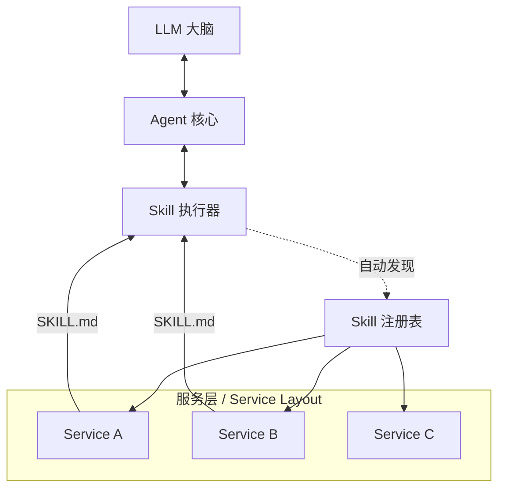

[English](../README.md) | **中文版**

# MyAgent: 基于技能构建的通用智能体框架

MyAgent 是一个基于动态**技能架构（Skill Architecture）**构建的**通用智能体（General Purpose Intelligent Agent）**。与具有硬编码工具的传统智能体不同，MyAgent 旨在通过分散的“技能”系统实现无限扩展。智能体需要搜索网络？只需放入一个 `websearch` 技能。需要执行代码？放入一个 `sandbox` 技能。

核心创新在于 **SKILL.md** 协议。每一项能力都包含在一个独立的服务目录中，只需要一个 `SKILL.md`（定义文件）和一个客户端实现。核心的 `SkillExecutor` 会自动发现、加载并编排这些技能，将它们作为可执行工具提供给大脑（LLM）。

---

## 🚀 核心概念：技能智能体 (Skill Agent)

在 MyAgent 中， **技能（Skill）** 是智能体能力的原子单位。

### 1. 协议 (SKILL.md)
每个技能由一个 Markdown 文件定义，具有双重用途：
- **系统元数据**：YAML Frontmatter 定义了如何加载代码（`client_class`）以及如何执行它（`default_method`）。
- **智能体知识**：Markdown 正文描述了该技能*做什么*以及*如何*使用，LLM 直接读取这些内容以理解自身的能力。

### 2. 架构



- **解耦**：技能与核心智能体逻辑解耦。
- **热插拔**：`SkillRegistry` 动态识别新技能。
- **自描述**：文档*即*接口。

## 🛠️ 特性

- **动态发现**：使用 `app/agent/core/skill_executor.py` 递归扫描 `services/` 目录以获取能力。
- **多模态**：支持文本、代码执行以及 VLM（视觉语言模型）技能。
- **标准化接口**：所有技能实现统一的 `Client` 接口，但通过 `SKILL.md` 暴露特定逻辑。
- **环境感知**：技能范围可从本地文件操作涵盖到远程 API 调用（联网搜索、RAG 等）。

## 📂 项目结构

```bash
myagent/
├── app/
│   ├── agent/
│   │   ├── core/
│   │   │   └── skill_executor.py  # 🧠 大脑之手：加载并执行技能
│   │   └── ...
├── services/                      # 🧱 技能仓库
│   ├── websearch_service/
│   │   ├── SKILL.md               # 📝 技能定义："我可以搜索网络..."
│   │   └── client.py              # ⚙️ 技能实现：实际搜索逻辑
│   ├── sandbox_service/
│   │   ├── SKILL.md
│   │   └── ...
│   └── ...
├── docker-compose.yml
└── ...
```

## 👣 快速开始

### 先决条件
- Docker & Docker Compose
- Python 3.11+

### 安装

1.  **克隆仓库**
    ```bash
    git clone https://github.com/Lin-A1/myagent.git
    cd myagent
    ```

2.  **环境配置**
    ```bash
    cp .env.example .env
    # 配置您的 API 密钥 (OpenAI, etc.)
    ```

3.  **使用 Docker 运行**
    ```bash
    docker-compose up --build
    ```

## � 前端界面


### 启动前端
前端需要在开发环境中启动：

1.  **启动后端**：确保 Docker 服务已运行。
2.  **启动前端**：
    ```bash
    cd web/frontend
    npm install
    npm run dev
    ```
3.  访问 `http://localhost:5173`

## 🔧 如何添加新技能

### 可执行技能（带 client）
1.  **创建目录**：`mkdir services/my_new_skill`
2.  **定义技能**：创建 `SKILL.md`。
    ```markdown
    ---
    name: my_new_skill
    description: 技能描述
    client_class: MyNewSkillClient
    default_method: run
    ---

    ## 使用方法
    描述给 LLM 看的内容...
    ```
3.  **实现客户端**：在 `client.py` 中创建 `MyNewSkillClient` 类。
4.  **重启**：智能体将自动检测到 `my_new_skill`。

### 文档类技能（无需 client）
用于创建参考文档、指南或模板，无需代码执行：

```markdown
---
name: coding_guidelines
description: 代码规范和最佳实践参考。
executable: false
related_tools:        # 可选：将此指南关联到其他工具
  - sandbox_service
---

## 指南内容
你的文档内容...
```

- 设置 `executable: false` 标记为文档类技能
- 使用 `related_tools` 将指南关联到可执行工具（指南内容会显示在那些工具下方）


## 📅 近期更新

### 2026-01-07
- ✅ **文档类技能**: 支持非可执行技能 (`executable: false`)，无需 `client.py` 即可创建参考文档。
- ✅ **工具关联**: 技能可声明 `related_tools` 将使用指南关联到可执行工具。
- ✅ **搜索策略优化**: 新增"知识优先"规则 - Agent 优先使用自身知识，减少不必要的搜索。
- ✅ **会话标题生成**: Agent 会话现在会根据对话内容自动生成有意义的标题。
- ✅ **UI 优化**: 
  - 顶栏固定，滚动时始终可见
  - 空状态页支持多行输入
  - Agent 模式动态背景色

### 计划中
- [ ] **文件操作服务** (`file_service`): 支持文件的增删改查能力。
- [ ] **Agent 工作空间**: 专属的文件操作空间，让智能体能够像 AI IDE 一样操作文件。
- [ ] **Todo 管理**: 管理任务和待办事项的能力。

---

